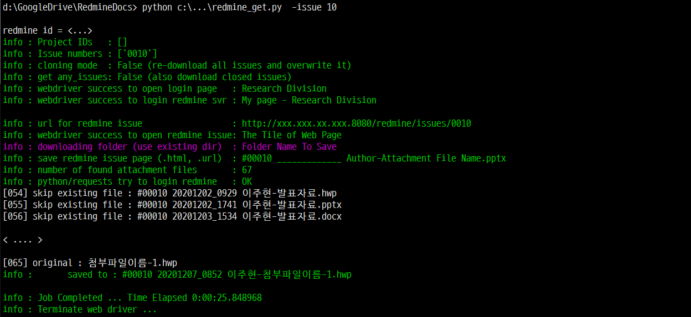
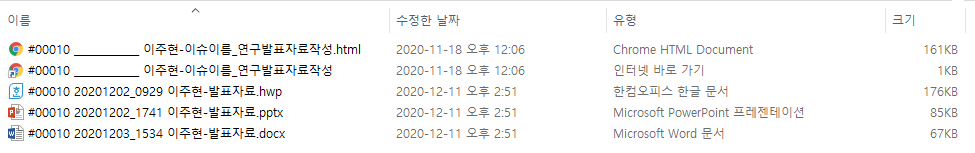

# redmine_get

 Python script for downloading & synchronizing redmine issues or projects.
 This command-line python script can download selected redmine issues or
 download all issues of multiple project.
 This script can
 - Login into redmine server using user's id and passwd
 - Download and save issue content as .url and .html files
 - Download and save all attachment files of multiple issues

   * attachment files
   * issue page (.url shortcut & .html)
## Screenshot

 - Script execution
	

 - Download and saved files
	

### The benefit of this script
 - It is command-line tool (even it is using Chrome webdriver with selenium) so that you can download all redmine contents in batch mode.
 - There also exist python API for Redmine (https://python-redmine.com) but it needs help from Redmine server administrator to use the API.
 - This script using Chrome browser (i.e. access exactly same as using web browser) therefore, nothing to do with Redmine server administrator.
 - It is simply python script ! It can be used on Windows or Linux or ...
 - Mostly I use the script on Windows10

### The limitation
 - This script use Chrome web browser in headless mode (i.e. non-GUI)
 - This script parses received html source and analyze, and then send 'click' on a specified object ... and so on.
 - Therefore, if the Redmine page is differ from what the script expects ... The click will be failed.
 - Anyway, I use this script several years with my organization's Redmine server, It works perfect until so far.

## Installation
 - Assume you already have python3 and familiar with it.
   - Python3 is needed because f'string syntax in the script

 - The script using Chrome web browser so, install Chrome browser if you dont have it. ( https://www.google.com/intl/ko/chrome/ )

 - Type followings on Chrome browser (to check version)
	```
	Alt-D (go to url address input)
	chrome://settings/help
	```
   - Please remember Chrome version (e.g. ... version 87.0.4280 64bit ... )
 
 - Download Chrome webdriver and save it
   - https://chromedriver.chromium.org/downloads
   - You should download correct version  which can support your Chrome browser.

 - Download the script
	```
	git clone http://github.com/juehyun/redmine_get  redmine_get.git
	```

 - Open 'redmine_get.py' script with your favorite editor
	```
	cd redmine_get.git
	gvim redmine_get.py
	```

 - Search following lines, change it to your Redmine server address and chrome driver path
	```
	# redmine server url
	URL_REDMINE_SERVER = 'http://xxx.xxx.xx.xxx:8080'
	PATH_CHROME_DRIVE  = 'C:\path\to\chromedriver_win32_87.0.4280.exe'
	```

 - This python script use following package

	```
	import grequests
	from selenium import webdriver
	from selenium.webdriver.common.desired_capabilities import DesiredCapabilities
	from selenium.webdriver.chrome.options import Options
	from bs4 import BeautifulSoup
	import requests
	import os
	import wget
	import urllib.request
	import win32clipboard
	import re
	import validators
	import getpass
	import pathlib
	import time
	import shutil
	import timeit
	import datetime
	import sys
	import unicodedata
	```

 - Install all needed python package as following ...
	```
	pip install selenium
	...
	...
	```

## Usage
 - Following options are available
	```
	-is(sue)     : download listed issues (.url, .html, all attachment files)
	-pr(oj)      : download all issues from listed project name
	               project name (proj_abc) can be found from your Redmine URL
	               http://your.redmineserver.org:8080/redmine/projects/proj_abc/issues
	                                                                   ^^^^^^^^
	-an(y_issue) : by default, the script download only 'open' issue. -an option download any issues (open and closed)
	-cl(one)     : by default, the script skip attachmemt file if same file exist on your local folder. -cl option force to overwrite
	```

 - Type as followings in command-line
	```
	> python path_to\redmine_get.py -proj  proj_a  proj_b  proj_c 
	> python path_to\redmine_get.py -issue 1319 1573 1554
	> python path_to\redmine_get.py -proj  proj_a  proj_c  -issue 1319 1513

	> python path_to\redmine_get.py -pr proj_vic proj_abc -is 1234 2346 -cl -an
	> python path_to\redmine_get.py -pr ab11
	> python path_to\redmine_get.py -is 1234 1295 1325

	> python path_to\redmine_get.py [Enter] to see usage
	```
